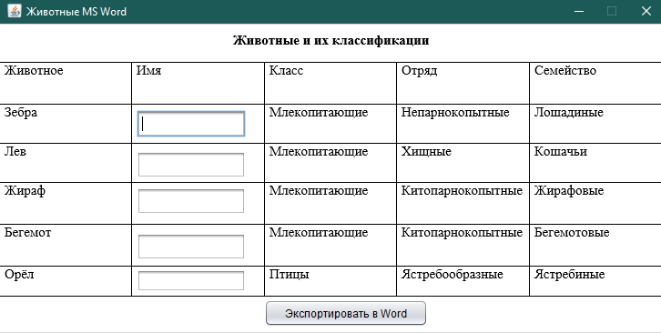

# ZZA_Apache_POI

Программа формирования оригинального отчета (заполненного бланка) в MS Word с использованием Apache POI 

Решение 5 задания 
Вариант - 5 (Животные)

Интерфейс программы: 
  
Данные, экспоритрованные в Word: 

